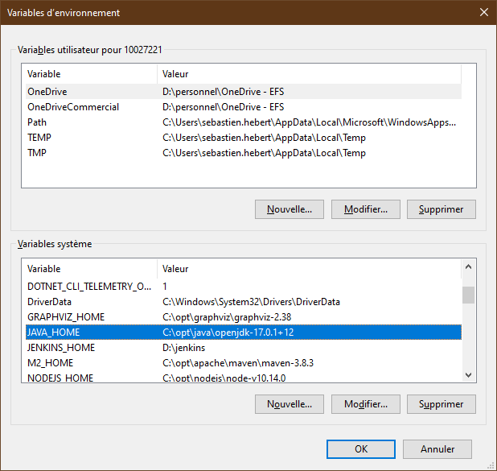
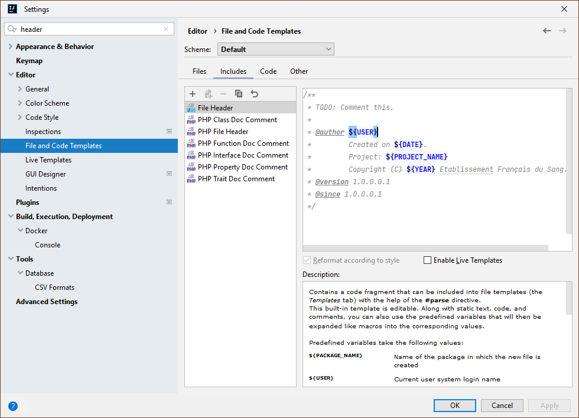
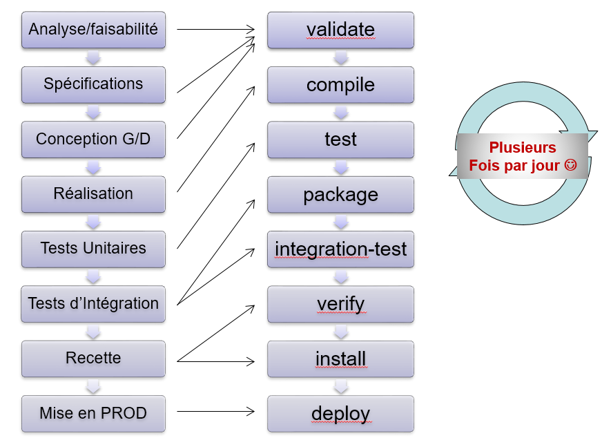

# DEDS Java Samples :: Hand-On-Lab

## TP 01 : Maven
Pour ce premier **TP**, nous allons apprendre à
* Configurer notre _environnement de développement_ **IntelliJ** avec **Maven** et **Java**,
* Comprendre la mécanique de base de _build d'un projet_ avec **Maven**,
* Faire un premier _test unitaire_ avec **JUnit**,
* Générer le _site web_ documentaire du projet.

### Partie 1 : Prérequis
Dans cette section, nous allons vérifier l'installation de **Java** et de **Maven**.

Que ce soit sur **Windows** ou **Linux**, le principe est à peu près le même.

Il convient d'abord de choisir sa _distribution_ de **Java 2 SE**.


|        Éditeur        | Versions supportées                                            | URL                                                                                                                                                                                                                 | Commentaires                                                                                                                                                                |
|:---------------------:|:---------------------------------------------------------------|:--------------------------------------------------------------------------------------------------------------------------------------------------------------------------------------------------------------------|:----------------------------------------------------------------------------------------------------------------------------------------------------------------------------|
|    Amazon Corretto    | Uniquement LTS (8, 11, 17).                                    | [https://aws.amazon.com/fr/corretto/](https://aws.amazon.com/fr/corretto/)                                                                                                                                          | Distribution basée sur **OpenJDK**. Proposée par **Amazon** sous licence **GPLv2**.                                                                                         |
| Azul Zulu Community™  | De la version 6 (LTS) à 19 (EA)                                | [https://www.azul.com/downloads/](https://www.azul.com/downloads/)                                                                                                                                                  | Distribution basée sur **OpenJDK**, proposée sous plusieurs éditions (gratuite, open source et payantes propriétaires (GC, JIT compiler). Proposée par **Microsoft Azure**. |
| BellSoft Belerica JDK | Versions LTS (8, 11, 17) et Current (18)                       | [https://bell-sw.com/pages/downloads/](https://bell-sw.com/pages/downloads/)                                                                                                                                        | Proposé par **Spring** et **VMWare** sur son **PaaS Tanzu**. Deux sous-versions à chaque fois constuites sur **OpenJDK** et **GraalVM**.                                    |
|  **Eclipse Temurin**  | Versions LTS (8, 11 et 17), intermédiaire (16) et Current (18) | [https://adoptium.net/temurin/releases](https://adoptium.net/temurin/releases) (Builds RedHat : [https://developers.redhat.com/products/openjdk/download](https://developers.redhat.com/products/openjdk/download)) | Généralement, les distributions **Linux** y compris **CentOS** et **RHEL** fournissent cette édition.                                                                       |
|  IBM Semeru Runtime   | Versions LTS (8, 11 et 17), intermédiaires (16) et EA (18)     | [https://developer.ibm.com/languages/java/semeru-runtimes/downloads/](https://developer.ibm.com/languages/java/semeru-runtimes/downloads/)                                                                          | Supporté par **IBM**. Construit sur **OpenJDK** mais en utilisant le moteur **OpenJ9** à la place de **HotSpot**.                                                           |
|      Oracle JDK       | De la version 1.2 à                                            | [http://www.oracle.com/technetwork/java/javase/downloads/index.html](http://www.oracle.com/technetwork/java/javase/downloads/index.html)                                                                            | Gratuit jusqu'à Java SE 8u202, payant à partir de la version 8u211.                                                                                                         |
|    Oracle OpenJDK     | De la version 7 à 19 (under dev)                               | [https://openjdk.java.net/projects/jdk/](https://openjdk.java.net/projects/jdk/)                                                                                                                                    | À ne pas confondre avec **RedHat OpenJDK**.                                                                                                                                 |
|    SAP SapMachine     | Versions LTS (11 et 17) et Current (18)                        | [https://sap.github.io/SapMachine/](https://sap.github.io/SapMachine/)                                                                                                                                              | Supporté par **SAP**.                                                                                                                                                       |
 |

Nous utiliserons la distribution **Eclipse Temurin** puisque c'est celle-ci qui est proposée par **RedHat**.

#### 1.1. Java
Pour **Java**, il convient d'installer un **JDK 17** par exemple (dernière version **LTS** au moment de la rédaction de ce document).

Sous **Linux RedHat EL 8.5**, l'installation est relativement simple :
````shell
$ sudo dnf install java-17-openjdk-devel
````

Sous **Windows**, décompressez l'archive dans `C:\opt\java\openjdk-17` par exemple. Il convient ensuite de créer la variable `JAVA_HOME` et de l'ajouter dans le `PATH` :



Dans le `PATH`, ajoutez la valeur `%JAVA_HOME%\bin`.

#### 1.2. Maven
Pour **Maven**, la version utilisée est la version **3.8.3** ou ultérieure.

Le principe est identique. Il convient de créer une variable `M2_HOME`, de la faire pointer sur le répertoire contenant une distribution **Maven** et de l'ajouter dans le `PATH` comme précédemment.

Sous **Linux**, créez par exemple le fichier `/etc/profile.d/deds-devenv.sh` :
````shell
export JAVA_HOME=/usr/lib/jvm/java-17-openjdk-amd64
export M2_HOME=/opt/apache/maven-3.8.3
export PATH=${M2_HOME}/bin:${PATH}
````

#### 1.3. IntelliJ
Dans cette section, nous allons configurer **IntelliJ** afin que tout le monde utilise les mêmes _conventions de codage_ ainsi que l'_entête par défaut_ des fichiers source Java.

Essayez de trouver le menu permettant de configurer l'entête :



Enfin, essayez de configurer les conventions de codage comme suit :

````xml
<code_scheme name="Default" version="173">
  <JavaCodeStyleSettings>
    <option name="CLASS_COUNT_TO_USE_IMPORT_ON_DEMAND" value="99" />
    <option name="NAMES_COUNT_TO_USE_IMPORT_ON_DEMAND" value="99" />
  </JavaCodeStyleSettings>
 <ScalaCodeStyleSettings>
    <option name="MULTILINE_STRING_CLOSING_QUOTES_ON_NEW_LINE" value="true" />
 </ScalaCodeStyleSettings>
 <codeStyleSettings language="JAVA">
    <option name="BRACE_STYLE" value="2" />
    <option name="CLASS_BRACE_STYLE" value="2" />
    <option name="METHOD_BRACE_STYLE" value="2" />
    <option name="LAMBDA_BRACE_STYLE" value="2" />
    <option name="ELSE_ON_NEW_LINE" value="true" />
    <option name="WHILE_ON_NEW_LINE" value="true" />
    <option name="CATCH_ON_NEW_LINE" value="true" />
    <option name="FINALLY_ON_NEW_LINE" value="true" />
  </codeStyleSettings>
</code_scheme>
````

### Partie 2 : Mécanique de build de Maven
Créez le fichier `pom.xml` à la racine du projet :

````xml
<?xml version="1.0" encoding="UTF-8"?>
<project xmlns="http://maven.apache.org/POM/4.0.0"
         xmlns:xsi="http://www.w3.org/2001/XMLSchema-instance"
         xsi:schemaLocation="http://maven.apache.org/POM/4.0.0 https://maven.apache.org/maven-v4_0_0.xsd">

    <!--  Object Model Version -->
    <modelVersion>4.0.0</modelVersion>

    <!-- Project METADATA -->
    <groupId>efs.deds.hol.modules</groupId>
    <artifactId>tp1</artifactId>
    <!-- MAJOR-Minor-Patch-Validation-Build -->
    <version>1.0.0.0.1-SNAPSHOT</version>
    <packaging>pom</packaging>

    <!-- Modules -->
    <modules>
        
    </modules>

    <!-- Common properties -->
    <properties>
    </properties>

    <!-- ################################################################################## -->
    <!-- ################################################################################## -->
    <!-- ############################## Build Settings #################################### -->
    <!-- ################################################################################## -->
    <!-- ################################################################################## -->
    <build>
    </build>

    <!-- Reports publication -->
    <reporting>
    </reporting>

    <!-- ################################################################################## -->
    <!-- ################################################################################## -->
    <!-- ############################## Project Information ############################### -->
    <!-- ################################################################################## -->
    <!-- ################################################################################## -->

    <!-- ################################################################################## -->
    <!-- ################################################################################## -->
    <!-- ############################## Environment Settings ############################## -->
    <!-- ################################################################################## -->
    <!-- ################################################################################## -->

</project>
````

Fermez puis rouvrez le projet.

#### 2.1. Premier build
Lancez un premier build :

````shell
$ mvn clean install
````

Le fonctionnement du _cycle de vie_ de **Maven** est présenté ici : [https://maven.apache.org/guides/introduction/introduction-to-the-lifecycle.html](https://maven.apache.org/guides/introduction/introduction-to-the-lifecycle.html)

Il existe donc un lien entre le _cycle de vie_ d'un **projet informatique** et le _cycle de vie_ de **Maven**.



Chaque _phase_ du _cycle de vie_ peut être associé à un ou plusieurs _plugins_. Il existe des _plugins_ pour plein de choses différentes :
* Compiler en **Java** ou en **C/C++**,
* Télécharger des dépendances externes pour **Java** ou même pour d'autres langages,
* Récupérer des dépendances en se branchant sur **NPM** et récupérer des frameworks web comme **Vue.js** ou **Angular**,
* Packager une librairie ou un exécutable **JAR**, une webapp **WAR**, un bundle **OSGI**,
* Compiler en code natif,
* Exécuter des tests unitaires, d'intégration, fonctionnels,
* Installer le résultat en local ou dans un dépôt distant,
* Construire une image **Docker** embarquant l'application et ses dépendances,
* Déployer sur un serveur d'applications, un cloud, un cluster **Kubernetes**,
* Générer le site web documentaire du projet,
* Passer un scan de vulnérabilités sur les sources du projet,
* Faire un audit statique et dynamique du code.
* Allumer les lumières de sa maison.

#### 2.2. Build répétable
**Maven** est un outil qui évolue souvent. Par conséquent, les développeurs peuvent se retrouver avec des versions différentes.

Le problème est qu'en fonction des versions de **Maven**, les _plugins_ associés (un _plugin_ est généralement associé à une ou plusieurs _phases_) n'auront pas la même version par défaut.

##### 2.2.1. Étape 1 : Maven Wrapper
**Maven Wrapper** est outil qui dit à **Maven** de télécharger et d'utiliser une autre version de **Maven** (paradoxe de _"l'œuf et de la poule ?"_).

````shell
$ mvn -N io.takari:maven:RELEASE:wrapper -Dmaven="3.8.3"
$ chmod +x mvnw
````

C'est utile pour un **serveur de CI** :
````shell
$ ./mvnw clean install
````

##### 2.2.2. Étape 2 : Forcer les versions des plugins
Modifiez la section  `<properties/>` :

````xml
<!-- Common properties -->
<properties>
    <!-- Maven common plugins versions -->
    <!-- Building -->
    <maven.clean.plugin.version>3.2.0</maven.clean.plugin.version>
    <maven.compiler.plugin.version>3.10.1</maven.compiler.plugin.version>
    <maven.deploy.plugin.version>3.0.0-M2</maven.deploy.plugin.version>
    <maven.install.plugin.version>3.0.0-M1</maven.install.plugin.version>
    <maven.resources.plugin.version>3.2.0</maven.resources.plugin.version>
    <maven.site.plugin.version>3.12.0</maven.site.plugin.version>
    <maven.surefire.plugin.version>3.0.0-M6</maven.surefire.plugin.version>
    <!-- Packaging -->
    <maven.jar.plugin.version>3.2.2</maven.jar.plugin.version>
    <maven.war.plugin.version>3.3.2</maven.war.plugin.version>
    <!-- QA -->
    <maven.jxr.plugin.version>3.2.0</maven.jxr.plugin.version>
    <maven.project.info.reports.plugin.version>3.2.2</maven.project.info.reports.plugin.version>
    <jacoco.maven.plugin.version>0.8.8</jacoco.maven.plugin.version>
    <!-- Documenting -->
    <maven.javadoc.plugin.version>3.4.0</maven.javadoc.plugin.version>
    <doxia.module.markdown.version>2.0.0-M2</doxia.module.markdown.version>
    <doxia.module.asciidoctor.version>2.2.2</doxia.module.asciidoctor.version>
    <asciidoctorj.version>2.5.3</asciidoctorj.version>
    <asciidoctorj.diagram.version>2.2.1</asciidoctorj.diagram.version>
    <!-- Tooling -->
    <maven.antrun.plugin.version>3.1.0</maven.antrun.plugin.version>
    <maven.dependency.plugin.version>3.3.0</maven.dependency.plugin.version>
    <maven.help.plugin.version>3.2.0</maven.help.plugin.version>
    <!-- 3rd part -->
    <versions.maven.plugin.version>2.10.0</versions.maven.plugin.version>
    <exec.maven.plugin.version>3.0.0</exec.maven.plugin.version>
    <!-- Maven Min Version -->
    <maven.min.version>3.8.3</maven.min.version>

    <!-- Project options -->
    <!-- (...) -->
</properties>
````

Plus d'informations sur les versions des plugins **Maven** : [https://maven.apache.org/plugins/index.html](https://maven.apache.org/plugins/index.html)

Les _propriétés_ précédentes vont servir à configurer les _versions des plugins_ dans la section `<build/>`.

La _configuration_ pour chaque _plugin_ se fait dans la section `<build/>` (nous allons le voir après) et malheureusement cette dernière est souvent très verbeuse. Pour éviter cela, la plupart des _plugins_ peuvent être _configurés_ via là-aussi des _propriétés_ (qui ne servent donc pas uniquement pour les numéros de versions). Il en existe de deux sortes :
* Des _propriétés_ globales qui s'appliquent à l'ensemble des _plugins_, par exemple `<project.build.sourceEncoding/>`, etc.
* Des _propriétés_ spécifiques à un voire même partagées entre plusieurs _plugins_, par exemple `<maven.compiler.fork/>`, `<maven.site.skip/>`, etc.

Les _propriétés_ ci-après vont permettre de configurer :
* Configurer l'encodage.
* Configurer le compilateur `javac`.
* Éviter de générer le site web documentaire à chaque build car cela prend beaucoup de temps.
* Éviter de déployer l'application à chaque build car un développeur passe plus de temps à compiler/tester.

````xml
<!-- Common properties -->
<properties>
    <!-- (...) -->
 
    <!-- Project options -->
    <!-- Encoding -->
    <project.build.sourceEncoding>UTF-8</project.build.sourceEncoding>
    <project.reporting.outputEncoding>${project.build.sourceEncoding}</project.reporting.outputEncoding>
    <!-- Compiler options -->
    <maven.compiler.fork>true</maven.compiler.fork>
    <maven.compiler.showDeprecation>true</maven.compiler.showDeprecation>
    <maven.compiler.showWarnings>true</maven.compiler.showWarnings>
    <maven.compiler.verbose>false</maven.compiler.verbose>
    <!-- the parameters=true option is critical so that RESTEasy works fine -->
    <maven.compiler.parameters>true</maven.compiler.parameters>
    <!-- Skipping default site generation -->
    <maven.site.skip>true</maven.site.skip>
    <!-- Skipping default deployment -->
    <maven.deploy.skip>true</maven.deploy.skip>
</properties>
````

Une bonne pratique reconnue est donc de mettre tout ce qui peut changer dans un projet (généralement les versions des plugins utilisés) dans des _proprietés_, de configurer tout ce qui peut l'être (donc les _plugins_) via des _propriétés_ globales ou spécifiques et de _configurer_ les _versions des plugins_ dans la section `<build/>`.

La _configuration_ des _plugins_ permet de faire beaucoup de choses et la difficulté de **Maven** vient du fait qu'il y a souvent plusieurs façons de faire ce qui ne facilite pas sa compréhension.

Les _plugins_ sont configurés en modifiant la section `<build/>`. Cette section comprend, entre autres, la sous-section `<pluginManagement/>` et la sous section `<plugins/>` :
* La section `<pluginManagement/>` est celle qui nous intéresse ici car c'est celle que nous allons utiliser pour définir les _versions_ des _plugins_ du projet ainsi que le comportement par défaut de chaque plugin.
* La section `<plugins>` peut sembler redondante avec la précédente car elle permet aussi de _configurer_ les _plugins_. Toutefois, son objectif est différent car elle permet d'activer des _plugins_ tiers ce que ne permet pas la section précédente.

Pour faciliter la compréhension, nous choisissons d'utiliser la section `<pluginManagement/>` pour _configurer_ chaque _plugin_ et la section <plugins/> pour activer les _plugins_ tiers.

**Note :** les "plugins **Maven**" sont "généralement" activés par défaut contrairement aux "_plugins_ tiers".

La _configuration_ du _build_ pourrait se faire comme suit :
````xml
<build>
    <defaultGoal>verify</defaultGoal>
    <finalName>${project.artifactId}</finalName>

    <!-- Plugins configuration -->
    <pluginManagement>
        <plugins>
            <!-- Maven Plugins -->
            <!-- Apache Maven Clean Plugin -->
            <!-- The Maven Clean Plugin is a plugin that removes files generated at build-time in a project's directory. -->
            <plugin>
                <artifactId>maven-clean-plugin</artifactId>
                <version>${maven.clean.plugin.version}</version>
            </plugin>
            <!-- Maven Plugins -->
            <!-- Apache Maven Compiler Plugin -->
            <!-- The Compiler Plugin is used to compile the sources of your project. -->
            <plugin>
                <artifactId>maven-compiler-plugin</artifactId>
                <version>${maven.compiler.plugin.version}</version>
            </plugin>
            <!-- Maven Plugins -->
            <!-- Apache Maven Deploy Plugin -->
            <!-- Uploads the project artifacts to the internal remote repository. -->
            <plugin>
                <artifactId>maven-deploy-plugin</artifactId>
                <version>${maven.deploy.plugin.version}</version>
            </plugin>
            <!-- Maven Plugins -->
            <!-- Apache Maven Install Plugin -->
            <!-- Copies the project artifacts to the user's local repository. -->
            <plugin>
                <artifactId>maven-install-plugin</artifactId>
                <version>${maven.install.plugin.version}</version>
            </plugin>
            <!-- Maven Plugins -->
            <!-- Apache Maven Resources Plugin -->
            <!-- The Resources Plugin handles the copying of project resources to the output directory. There are two different kinds of resources: main resources and test resources. The difference is that the main resources are the resources associated to the main source code while the test resources are associated to the test source code. Thus, this allows the separation of resources for the main source code and its unit tests. -->
            <plugin>
                <artifactId>maven-resources-plugin</artifactId>
                <version>${maven.resources.plugin.version}</version>
            </plugin>
            <!-- Maven Plugins -->
            <!-- Apache Maven Site Plugin -->
            <!-- The Maven Site Plugin is a plugin that generates a site for the current project. -->
            <plugin>
                <artifactId>maven-site-plugin</artifactId>
                <version>${maven.site.plugin.version}</version>
            </plugin>
            <!-- Maven Plugins -->
            <!-- Asciidoctor Maven Plugin and Doxia Parser -->
            <!-- Asciidoctor Maven Plugin and Doxia Parser (for Maven Site integration) -->
            <plugin>
                <groupId>org.asciidoctor</groupId>
                <artifactId>asciidoctor-maven-plugin</artifactId>
                <version>${doxia.module.asciidoctor.version}</version>
            </plugin>
            <!-- Maven Plugins -->
            <!-- Maven Surefire Plugin -->
            <!-- Maven Surefire MOJO in maven-surefire-plugin. -->
            <plugin>
                <artifactId>maven-surefire-plugin</artifactId>
                <version>${maven.surefire.plugin.version}</version>
            </plugin>
         
            <!-- Maven Plugins -->
            <!-- Apache Maven JAR Plugin -->
            <!-- Builds a Java Archive (JAR) file from the compiled project classes and resources. -->
            <plugin>
                <artifactId>maven-jar-plugin</artifactId>
                <version>${maven.jar.plugin.version}</version>
            </plugin>
            <!-- Maven Plugins -->
            <!-- Apache Maven WAR Plugin -->
            <!-- Builds a Web Application Archive (WAR) file from the project output and its dependencies. -->
            <plugin>
                <artifactId>maven-war-plugin</artifactId>
                <version>${maven.war.plugin.version}</version>
            </plugin>
         
            <!-- Maven Plugins -->
            <!-- Maven JXR Plugin -->
            <plugin>
                <artifactId>maven-jxr-plugin</artifactId>
                <version>${maven.jxr.plugin.version}</version>
            </plugin>
            <!-- Maven Plugins -->
            <!-- Apache Maven Project Info Reports Plugin -->
            <!-- The Maven Project Info Reports Plugin is a plugin that generates standard reports for the specified project. -->
            <plugin>
                <artifactId>maven-project-info-reports-plugin</artifactId>
                <version>${maven.project.info.reports.plugin.version}</version>
            </plugin>
            <!-- Maven Plugins -->
            <!-- JaCoCo :: Maven Plugin -->
            <!-- The JaCoCo Maven Plugin provides the JaCoCo runtime agent to your tests and allows basic report creation.  -->
            <plugin>
                <groupId>org.jacoco</groupId>
                <artifactId>jacoco-maven-plugin</artifactId>
                <version>${jacoco.maven.plugin.version}</version>
            </plugin>
         
            <!-- Maven Plugins -->
            <!-- Apache Maven Javadoc Plugin -->
            <!-- The Apache Maven Javadoc Plugin is a plugin that uses the javadoc tool for generating javadocs for the specified project. -->
            <plugin>
                <artifactId>maven-javadoc-plugin</artifactId>
                <version>${maven.javadoc.plugin.version}</version>
                <configuration>
                    <show>private</show>
                </configuration>
            </plugin>
         
            <!-- Maven Plugins -->
            <!-- Apache Maven AntRun Plugin -->
            <!-- Runs Ant scripts embedded in the POM -->
            <plugin>
                <artifactId>maven-antrun-plugin</artifactId>
                <version>${maven.antrun.plugin.version}</version>
            </plugin>
            <!-- Maven Plugins -->
            <!-- Apache Maven Dependency Plugin -->
            <!-- Provides utility goals to work with dependencies like copying, unpacking, analyzing, resolving and many more. -->
            <plugin>
                <artifactId>maven-dependency-plugin</artifactId>
                <version>${maven.dependency.plugin.version}</version>
            </plugin>
            <!-- Maven Plugins -->
            <!-- Apache Maven Help Plugin -->
            <!-- The Maven Help plugin provides goals aimed at helping to make sense out of the build environment. It includes the ability to view the effective POM and settings files, after inheritance and active profiles have been applied, as well as a describe a particular plugin goal to give usage information. -->
            <plugin>
                <artifactId>maven-help-plugin</artifactId>
                <version>${maven.help.plugin.version}</version>
                <executions>
                    <execution>
                        <id>display-java-version</id>
                        <phase>validate</phase>
                        <goals>
                            <goal>active-profiles</goal>
                        </goals>
                    </execution>
                </executions>
            </plugin>
         
            <!-- 3rd part -->
            <!-- Maven Plugins -->
            <!-- Versions Maven Plugin -->
            <!-- Versions Plugin for Maven 2. The Versions Plugin updates the versions of components in the POM. -->
            <plugin>
                <groupId>org.codehaus.mojo</groupId>
                <artifactId>versions-maven-plugin</artifactId>
                <version>${versions.maven.plugin.version}</version>
            </plugin>
            <!-- Maven Plugins -->
            <!-- Exec Maven Plugin -->
            <!-- A plugin to allow execution of system and Java programs -->
            <plugin>
                <groupId>org.codehaus.mojo</groupId>
                <artifactId>exec-maven-plugin</artifactId>
                <version>${exec.maven.plugin.version}</version>
            </plugin>
        </plugins>
    </pluginManagement>
</build>
````

La _configuration_ précédente définit ainsi les _versions_ pour chaque _plugin_ qui seront utilisées, et cela pour l'ensemble des _modules_ du projet.

Certains _plugins_ ont été _configurés_ spécifiquement pour modifier leur comportement par défaut :
* Le plugin **Javadoc** permet de générer la documentation liée au code source mais par défaut, seuls les éléments relatifs à l'API publique sont générés. Ce comportement a été modifié pour générer également les éléments documentaires liés à l'implémentation interne. 
* Le plugin **Help** propose des fonctions utilitaires comme par exemple afficher la version du compilateur `javac`. Toutefois, cette fonctionnalité n'a par défaut "attachée" à aucune des phases du _cycle de vie_ **Maven**.

### Partie 3 : Configuration de la génération de la documentation du projet
Le plugin **Maven Site Plugin** permet de générer la _documentation technique_ d'un projet.

La section `<reporting>` permet de configurer uniquement les _plugins_ dédiés à la documentation technique.

````xml
<!-- Reports publication -->
<reporting>
    <plugins>
        <!-- Maven Plugins -->
        <!-- Maven JXR Plugin -->
        <plugin>
            <!--suppress MavenModelInspection -->
            <artifactId>maven-jxr-plugin</artifactId>
        </plugin>

        <!-- Maven Plugins -->
        <!-- Apache Maven Project Info Reports Plugin -->
        <!-- The Maven Project Info Reports Plugin is a plugin that generates standard reports for the specified project. -->
        <plugin>
            <artifactId>maven-project-info-reports-plugin</artifactId>
            <reportSets>
                <reportSet>
                    <reports>
                        <report>ci-management</report>
                        <report>dependencies</report>
                        <report>dependency-convergence</report>
                        <report>dependency-info</report>
                        <report>distribution-management</report>
                        <report>index</report>
                        <report>issue-management</report>
                        <report>licenses</report>
                        <report>mailing-lists</report>
                        <report>plugin-management</report>
                        <report>plugins</report>
                        <report>scm</report>
                        <report>summary</report>
                        <report>team</report>
                    </reports>
                </reportSet>
            </reportSets>
        </plugin>

        <!-- Maven Plugins -->
        <!-- JaCoCo :: Maven Plugin -->
        <!-- The JaCoCo Maven Plugin provides the JaCoCo runtime agent to your tests and allows basic report creation.  -->
        <plugin>
            <groupId>org.jacoco</groupId>
            <artifactId>jacoco-maven-plugin</artifactId>
            <reportSets>
                <reportSet>
                    <reports>
                        <!-- select non-aggregate reports -->
                        <report>report</report>
                    </reports>
                </reportSet>
            </reportSets>
        </plugin>
    </plugins>
</reporting>
````

Parmi les _rapports_ du projet, il existe un certain nombre de pages web qui peuvent être générées à partir des informations extraites du fichier `pom.xml` :
* La _carte d'identité_ du projet,
* L'_équipe_ de development et d'autres contributeurs au projet,
* L'organisation et l'_environnement_ du projet.

Ces informations peuvent être définies comme suit :

````xml
<project>
    <!-- (...) -->
 
    <!-- ################################################################################## -->
    <!-- ################################################################################## -->
    <!-- ############################## Project Information ############################### -->
    <!-- ################################################################################## -->
    <!-- ################################################################################## -->
    <!-- PROJECT INFORMATION -->
    <name>DEDS :: Java :: Hands-Of-Lab :: Parent Project</name>
    <description>Bac à sable Java pour le DEDS</description>
    <url>https://partagez.efs.sante.ban/</url>
    <inceptionYear>2022</inceptionYear>
    
    <!-- Licenses -->
    <licenses>
        <license>
            <name>Apache License, Version 2.0</name>
            <url>https://www.apache.org/licenses/LICENSE-2.0.txt</url>
            <distribution>repo</distribution>
            <comments>A business-friendly OSS license</comments>
        </license>
    </licenses>
    
    <!-- Organization -->
    <organization>
        <name>Etablissement Français du Sang</name>
        <url>https://partagez.efs.sante.ban/</url>
    </organization>
    
    <!-- Équipe -->
    <developers>
        <developer>
            <id>christophe</id>
            <name>Christophe Baribaud</name>
            <email>chistophe.baribaud@efs.sante.fr</email>
            <url>https://eur.delve.office.com/?u=09a27049-6557-46f6-85a0-d9fc4d6fc276&amp;v=work</url>
            <organization>DEDS</organization>
            <organizationUrl>https://eur.delve.office.com/?u=09a27049-6557-46f6-85a0-d9fc4d6fc276&amp;=work</organizationUrl>
            <roles>
                <role>Développeur</role>
            </roles>
            <timezone>Europe/Paris</timezone>
            <properties>
                <title>Ingénieur développement</title>
            </properties>
        </developer>
        <developer>
            <id>nadir</id>
            <name>Nadir Aichoune</name>
            <email>nadir.aichoune@efs.sante.fr</email>
            <url>https://eur.delve.office.com/?u=0a4ca970-e918-44d5-b991-3401f5ef1496&amp;v=work</url>
            <organization>DEDS</organization>
            <organizationUrl>https://eur.delve.office.com/?u=0a4ca970-e918-44d5-b991-3401f5ef1496&amp;v=work</organizationUrl>
            <roles>
                <role>Développeur</role>
            </roles>
            <timezone>Europe/Paris</timezone>
            <properties>
                <title>Ingénieur développement</title>
            </properties>
        </developer>
        <developer>
            <id>najlae</id>
            <name>Najlae Cherkaoui</name>
            <email>najlae.cherkaoui@efs.sante.fr</email>
            <url>https://eur.delve.office.com/?u=808f4b8f-4544-4110-b1e1-55c70de56675&amp;v=work</url>
            <organization>DEDS</organization>
            <organizationUrl>https://eur.delve.office.com/?u=808f4b8f-4544-4110-b1e1-55c70de56675&amp;v=work</organizationUrl>
            <roles>
                <role>Développeuse</role>
            </roles>
            <timezone>Europe/Paris</timezone>
            <properties>
                <title>Ingénieure développement</title>
            </properties>
        </developer>
        <developer>
            <id>olivier</id>
            <name>Olivier Hernot</name>
            <email>olivier.hernot@efs.sante.fr</email>
            <url>https://eur.delve.office.com/?u=7854ee6c-acfd-4e0d-9e5d-9f4f0a25f48e&amp;v=work</url>
            <organization>DEDS</organization>
            <organizationUrl>https://eur.delve.office.com/?u=7854ee6c-acfd-4e0d-9e5d-9f4f0a25f48e&amp;v=work</organizationUrl>
            <roles>
                <role>Chef de projet</role>
                <role>Leader technique</role>
            </roles>
            <timezone>America/Martinique</timezone>
            <properties>
                <title>Chef de projet</title>
            </properties>
        </developer>
    </developers>
    
    <!-- Contributors -->
    <contributors>
        <contributor>
            <name>Eric</name>
            <email>eric.perrot@efs.sante.fr</email>
            <url>https://eur.delve.office.com/?u=a2b62cec-78ef-42ac-adb7-05f62fa51d96&amp;v=work</url>
            <organization>DEDS</organization>
            <organizationUrl>https://eur.delve.office.com/?u=a2b62cec-78ef-42ac-adb7-05f62fa51d96&amp;v=work</organizationUrl>
            <roles>
                <role>Service Owner</role>
            </roles>
            <timezone>Europe/Paris</timezone>
            <properties>
                <title>Responsable Département Études et Développements Spécifiques (DEDS)</title>
            </properties>
        </contributor>
        <contributor>
            <name>Kevin</name>
            <email>kevin.gaillard@efs.sante.fr</email>
            <url>https://eur.delve.office.com/?u=55e5858d-5a38-4237-866b-c81e707cb8d8&amp;v=work</url>
            <organization>DEDS</organization>
            <organizationUrl>https://eur.delve.office.com/?u=55e5858d-5a38-4237-866b-c81e707cb8d8&amp;v=work</organizationUrl>
            <roles>
                <role>Testeur</role>
            </roles>
            <timezone>Europe/Paris</timezone>
            <properties>
                <title>Testeur</title>
            </properties>
        </contributor>
        <contributor>
            <name>Michael</name>
            <email>michael.thorel@efs.sante.fr</email>
            <url>https://eur.delve.office.com/?u=4b2ace29-24f5-4d62-95a4-4286de0de32f&amp;v=work</url>
            <organization>DEDS</organization>
            <organizationUrl>https://eur.delve.office.com/?u=4b2ace29-24f5-4d62-95a4-4286de0de32f&amp;v=work</organizationUrl>
            <roles>
                <role>Testeur</role>
            </roles>
            <timezone>Europe/Paris</timezone>
            <properties>
                <title>Testeur</title>
            </properties>
        </contributor>
        <contributor>
            <name>Vincent</name>
            <email>vincent.gounelle@efs.sante.fr</email>
            <url>https://eur.delve.office.com/?u=b6a2d831-b118-4eb2-8b99-e229a74d24df&amp;v=work</url>
            <organization>DEDS</organization>
            <organizationUrl>https://eur.delve.office.com/?u=b6a2d831-b118-4eb2-8b99-e229a74d24df&amp;v=work</organizationUrl>
            <roles>
                <role>Chargé de spécifications</role>
            </roles>
            <timezone>Europe/Paris</timezone>
            <properties>
                <title>Chef de projet</title>
            </properties>
        </contributor>
    </contributors>
 
    <!-- (...) -->
</project>
````

Les informations relatives à l'_environnement_ du projet concernent à l'outil interne de gestion d'incidents, le serveur de CI le cas échéant, etc :

````xml
<project>
    <!-- (...) -->

    <!-- ################################################################################## -->
    <!-- ################################################################################## -->
    <!-- ############################## Environment Settings ############################## -->
    <!-- ################################################################################## -->
    <!-- ################################################################################## -->
    <!-- Issue Management -->
    <issueManagement>
        <system>YouTrack</system>
        <url>http://vpx-ccllvcs01.app.efs.sante.ban/youtrack</url>
    </issueManagement>
    <!-- Continous Integration Management -->
    <ciManagement>
        <system>Jenkins</system>
        <url>http://vpx-ccllvcs01.app.efs.sante.ban/jenkins</url>
        <notifiers>
            <notifier>
                <type>mail</type>
                <sendOnError>true</sendOnError>
                <sendOnFailure>true</sendOnFailure>
                <sendOnSuccess>false</sendOnSuccess>
                <sendOnWarning>false</sendOnWarning>
                <configuration>
                    <address>Efs-Deds@efs.sante.fr</address>
                </configuration>
            </notifier>
        </notifiers>
    </ciManagement>
    <!-- Mailing List -->
    <mailingLists>
        <mailingList>
            <name>Efs-Deds</name>
            <post>Efs-Deds@efs.sante.fr</post>
        </mailingList>
    </mailingLists>
    <!-- SCM -->
    <scm>
        <connection>scm:git:ssh://ccll@vpx-ccllvcs01.app.efs.sante.ban/~/git-repos/deds-samples/deds-java-hol.git</connection>
        <developerConnection>scm:git:ssh://ccll@vpx-ccllvcs01.app.efs.sante.ban/~/git-repos/deds-samples/deds-java-hol.git</developerConnection>
        <url>scm:git:ssh://ccll@vpx-ccllvcs01.app.efs.sante.ban/~/git-repos/deds-samples/deds-java-hol.git</url>
    </scm>
</project>
````

#### 3.1. Ajout du module docs
Créez le fichier `pom.xml` suivant dans le sous-répertoire `docs` :

````xml
<?xml version="1.0" encoding="UTF-8"?>
<project xmlns="http://maven.apache.org/POM/4.0.0"
         xmlns:xsi="http://www.w3.org/2001/XMLSchema-instance"
         xsi:schemaLocation="http://maven.apache.org/POM/4.0.0 https://maven.apache.org/maven-v4_0_0.xsd">

    <!--  Object Model Version -->
    <modelVersion>4.0.0</modelVersion>
   
    <!-- Project METADATA -->
    <parent>
        <groupId>efs.deds.hol.modules</groupId>
        <artifactId>tp1</artifactId>
        <!-- MAJOR-Minor-Patch-Validation-Build -->
        <version>1.0.0.0.1-SNAPSHOT</version>
        <relativePath>../pom.xml</relativePath>
    </parent>
   
    <artifactId>docs</artifactId>
    <packaging>pom</packaging>
   
    <!-- Common properties -->
    <properties>
        <!-- Project options -->
        <!-- Enabling default site generation -->
        <maven.site.skip>false</maven.site.skip>
    </properties>
   
    <!-- ################################################################################## -->
    <!-- ################################################################################## -->
    <!-- ############################## Project Information ############################### -->
    <!-- ################################################################################## -->
    <!-- ################################################################################## -->
    <!-- PROJECT INFORMATION -->
    <name>DEDS :: Java :: Hands-Of-Lab :: Documentation</name>
    <description>Documentation pour le bac à sable Java</description>
</project>
````

Modifiez enfin comme suit la liste des _modules_ dans le fichier `pom.xml` parent pour y ajouter le module `docs` :

````xml
<!-- Modules -->
<modules>
    <module>docs</module>
</modules>
````

Rechargez enfin le projet **Maven** dans **IntelliJ** puis construisez le projet :

````shell
$ ./mvnw clean site
````

Le sous-répertoire `docs/target/site` a été créé avec du contenu. Lancez un navigateur sur la page `index.html`.

##### 3.1.1. Étape 1 : Configuration du plugin "Maven Site Plugin"

Le site web créé est en langue anglaise. Il est possible de _configurer_ cela comme suit :

````xml
<?xml version="1.0" encoding="UTF-8"?>
<project>
    <!-- (...) -->

    <!-- ################################################################################## -->
    <!-- ################################################################################## -->
    <!-- ############################## Build Settings #################################### -->
    <!-- ################################################################################## -->
    <!-- ################################################################################## -->
    <build>
        <!-- Plugins configuration -->
        <pluginManagement>
            <plugins>
                <!-- Maven Plugins -->
                <!-- Apache Maven Site Plugin -->
                <!-- The Maven Site Plugin is a plugin that generates a site for the current project. -->
                <plugin>
                    <artifactId>maven-site-plugin</artifactId>
                    <configuration>
                        <generateReports>true</generateReports>
                        <generateSitemap>true</generateSitemap>
                        <relativizeDecorationLinks>false</relativizeDecorationLinks>
                        <locales>fr</locales>
                        <inputEncoding>${project.build.sourceEncoding}</inputEncoding>
                        <outputEncoding>${project.reporting.outputEncoding}</outputEncoding>
                    </configuration>
                </plugin>
            </plugins>
        </pluginManagement>
    </build>
 
    <!-- (...) -->
</project>
````

Après une reconstruction via `./mvnw clean site`, le _site_ est traduit en français. On notera l'existence de la page `readme.html` qui est le résultat de la traduction de la page `readme.md` en **HTML**.

**Maven Site Plugin** est en effet capable de traduire du contenu écrit en **Markdown** mais aussi en **AsciiDoc**. Avant la version `3.3` du _plugin_ **Maven Site Plugin**, il fallait ajouter manuellement une _dépendance_ spécifique au _plugin_ comme suit :

````xml
<!-- Maven Plugins -->
<!-- Apache Maven Site Plugin -->
<!-- The Maven Site Plugin is a plugin that generates a site for the current project. -->
<plugin>
    <artifactId>maven-site-plugin</artifactId>
    <dependencies>
        <!-- Doxia :: Markdown Module -->
        <!-- A Doxia module for Markdown source documents.  -->
        <dependency>
            <groupId>org.apache.maven.doxia</groupId>
            <artifactId>doxia-module-markdown</artifactId>
            <version>${doxia.module.markdown.version}</version>
        </dependency>
    </dependencies>
    <configuration>
        <generateReports>true</generateReports>
        <generateSitemap>true</generateSitemap>
        <relativizeDecorationLinks>false</relativizeDecorationLinks>
        <locales>fr</locales>
        <inputEncoding>${project.build.sourceEncoding}</inputEncoding>
        <outputEncoding>${project.reporting.outputEncoding}</outputEncoding>
    </configuration>
</plugin>
````

##### 3.1.2. Étape 2 : Ajout de ressources spécifiques

La page web `readme.html` présente un problème ; il semble manquer les images qui ne sont pas des _ressources_ **Markdown**. Pour résoudre ce problème, il est possible de configurer le plugin **Maven Resources Plugin** comme suit :

````xml
<!-- Plugins configuration -->
<pluginManagement>
    <plugins>
        <!-- Maven Plugins -->
        <!-- Apache Maven Resources Plugin -->
        <!-- The Resources Plugin handles the copying of project resources to the output directory. There are two different kinds of resources: main resources and test resources. The difference is that the main resources are the resources associated to the main source code while the test resources are associated to the test source code. Thus, this allows the separation of resources for the main source code and its unit tests. -->
        <plugin>
            <artifactId>maven-resources-plugin</artifactId>
            <executions>
                <execution>
                    <id>copy-markdown-images</id>
                    <phase>site</phase>
                    <goals>
                        <goal>copy-resources</goal>
                    </goals>
                    <configuration>
                        <resources>
                            <resource>
                                <directory>src/site/markdown</directory>
                                <includes>
                                    <include>**/*.jpg</include>
                                    <include>**/*.png</include>
                                </includes>
                            </resource>
                        </resources>
                        <outputDirectory>target/site</outputDirectory>
                    </configuration>
                </execution>
            </executions>
        </plugin>
        <!-- (...) -->
    </plugins>
</pluginManagement>
````

Toutefois, le plugin **Maven Resources Plugin** n'est pas automatiquement activé dans le cas de projets ayant le type de _packaging_ `pom`. Il convient donc d'ajouter une section `<plugins/>` comme suit :

````xml
<!-- ################################################################################## -->
<!-- ################################################################################## -->
<!-- ############################## Build Settings #################################### -->
<!-- ################################################################################## -->
<!-- ################################################################################## -->
<build>
    <!-- Plugins configuration -->
    <pluginManagement>
        <plugins>
            <!-- (...) -->
        </plugins>
    </pluginManagement>

    <!-- List of plugins (activation if any) -->
    <plugins>
        <!-- Maven Plugins -->
        <!-- Apache Maven Resources Plugin -->
        <!-- The Resources Plugin handles the copying of project resources to the output directory. There are two different kinds of resources: main resources and test resources. The difference is that the main resources are the resources associated to the main source code while the test resources are associated to the test source code. Thus, this allows the separation of resources for the main source code and its unit tests. -->
        <plugin>
            <artifactId>maven-resources-plugin</artifactId>
        </plugin>
    </plugins>
</build>
````

Cette fois-ci les images devraient apparaître après un nouvel appel à `./mvnw clean site`.

##### 3.1.3. Étape 3 : Personnalisation du site généré

Un défaut est à noter dans l'état du site web documentaire ; il manque une entrée à la page `readme.html` dans le menu du site.

Pour cela, nous allons pouvoir personnaliser le menu du site web documentaire. Créez le fichier `docs/src/site/site.xml` comme suit :

````xml
<?xml version="1.0" encoding="UTF-8"?>
<project xmlns="http://maven.apache.org/DECORATION/1.8.0"
         xmlns:xsi="http://www.w3.org/2001/XMLSchema-instance"
         xsi:schemaLocation="http://maven.apache.org/DECORATION/1.8.0 http://maven.apache.org/xsd/decoration-1.8.0.xsd"
         name="DEDS :: Java :: Hands-Of-Lab :: Documentation">

    <!-- Modern Skin -->
    <!-- Apache Maven Fluido Skin -->
    <!-- The Apache Maven Fluido Skin is an Apache Maven site skin built on top of Twitter's bootstrap. -->
    <skin>
        <groupId>org.apache.maven.skins</groupId>
        <artifactId>maven-fluido-skin</artifactId>
        <version>1.10.0</version>
    </skin>
   
    <!-- Bannières -->
    <bannerRight>
        <name>Etablissement Français du Sang</name>
        <src>/images/logo-efs.png</src>
        <href>https://partagez.efs.sante.ban/</href>
        <width>93</width>
    </bannerRight>
   
    <!-- Format de la date de publication -->
    <publishDate format="dd/MM/yyyy" position="right"/>
   
    <!-- Position de la version -->
    <version position="right" />
   
    <!-- Powered By -->
    <poweredBy>
        <logo name="Apache TomEE" href="#" img="/images/logo-tomee.png" width="93" />
    </poweredBy>
   
    <body>
   
     <head>
      <![CDATA[
          <link rel="stylesheet" href="https://use.fontawesome.com/releases/v5.0.13/css/all.css" integrity="sha384-DNOHZ68U8hZfKXOrtjWvjxusGo9WQnrNx2sqG0tfsghAvtVlRW3tvkXWZh58N9jp" crossorigin="anonymous" />
               ]]>
     </head>
   
     <links>
        <item name="EFS" href="https://partagez.efs.sante.ban/" target="_blank" />
        <item name="Jakarta® EE Tutorial" href="https://eclipse-ee4j.github.io/jakartaee-tutorial/" target="_blank" />
        <item name="Domain-Driven-Design" href="https://eclipse-ee4j.github.io/cargotracker/" target="_blank" />
        <item name="MicroProfile" href="https://microprofile.io/" target="_blank" />
        <item name="Apache TomEE" href="https://tomee.apache.org/docs.html" target="_blank" />
     </links>
   
     <breadcrumbs>
        <item name="Plan du site" href="/sitemap.html" target="_blank" />
     </breadcrumbs>
   
     <!-- Maven reports -->
     <menu ref="reports"/>
   
     <!-- Custom content -->
     <menu name="Travaux pratiques">
        <item href="readme.html" name="TP 01 : Maven" />
     </menu>
   
        <footer><![CDATA[Copyright &#9400; 2022 - Établissement Français du Sang.]]></footer>
    </body>
   
    <!-- Advanced Configuration -->
    <custom>
        <!-- Layout -->
        <fluidoSkin>
        <topBarEnabled>false</topBarEnabled>
        <sideBarEnabled>true</sideBarEnabled>
        <leftColumnClass>span3</leftColumnClass>
        <bodyColumnClass>span9</bodyColumnClass>
        <breadcrumbDivider>::</breadcrumbDivider>
        </fluidoSkin>
    </custom>
</project>
````

### Partie 4 : Ajout d'un test unitaire Java
Dans cette partie, nous allons ajouter un premier _module_ de développement **Java**.

Le concept de _modules_ est optionnel dans le sens où tout ce qui suit dans ce chapitre pourrait directement être ajouté au fichier `pom.xml` actuel.

Toutefois, l'organisation des sources pour les différents **TPs** est amenée à évoluer et donc à terme, il se pourrait qu'il y ait autant de _modules_ que de **TPs**.

Créez le sous-répertoire `01-testing` comprenant le fichier `pom.xml` suivant :

````xml
<?xml version="1.0" encoding="UTF-8"?>
<project xmlns="http://maven.apache.org/POM/4.0.0"
         xmlns:xsi="http://www.w3.org/2001/XMLSchema-instance"
         xsi:schemaLocation="http://maven.apache.org/POM/4.0.0 https://maven.apache.org/maven-v4_0_0.xsd">

    <!--  Object Model Version -->
    <modelVersion>4.0.0</modelVersion>

    <!-- Project METADATA -->
    <parent>
        <groupId>efs.deds.hol.modules</groupId>
        <artifactId>tp1</artifactId>
        <!-- MAJOR-Minor-Patch-Validation-Build -->
        <version>1.0.0.0.1-SNAPSHOT</version>
        <relativePath>../pom.xml</relativePath>
    </parent>

    <artifactId>01-testing</artifactId>

    <!-- Common properties -->
    <properties>
        <!-- Project options -->
        <!-- Enabling default site generation -->
        <maven.site.skip>false</maven.site.skip>

        <!-- JUnit Test Framework -->
        <junit.jupiter.version>5.8.2</junit.jupiter.version>

        <!-- JUnit default groups -->
        <junit.include.groups>unit, integration, functional, end-to-end</junit.include.groups>
        <junit.exclude.groups/>
    </properties>

    <!-- ################################################################################## -->
    <!-- ################################################################################## -->
    <!-- ############################## Project Information ############################### -->
    <!-- ################################################################################## -->
    <!-- ################################################################################## -->
    <!-- PROJECT INFORMATION -->
    <name>DEDS :: Java :: Hands-Of-Lab :: 01 Tests unitaires</name>
    <description>01-Tests unitaires</description>
</project>
````

Ce fichier `pom.xml` est similaire à celui qui a été initialement créé pour le module `docs`.

Toutefois, nous avons quelques propriétés supplémentaires qui vont servir à configurer **JUnit** :
* La version **JUnit** utilisée à servir la version `5.8.2`.
* Les types de _tests_ qui seront utilisés et ceux qui seront ignorés :
  * Les _tests unitaires_ construits selon le pattern _Given / When / Then_ consistent à tester les classes de façon isolée, les dépendances de classes devant être bouchonnées.
  * Les _tests d'intégration_, par exemple la persistance d'un graphe d'objets dans une base de données de test. Ces tests optionnels peuvent être intéressants pour debugger des cas complexes mais présentent comme inconvénient une certaine lenteur d'exécution par rapport aux _tests unitaires_.
  * Les _tests fonctionnels_ sont des tests **BDD** (**B**ehaviour **D**riven **D**esign) basés sur **Gherkin**.
  * Les _tests de bout en bout_ consistent à tester un **Use Case** et sont les plus difficiles à mettre en œuvre car ils nécessitent de pouvoir simuler les actions d'un utilisateur derrière son écran.

Modifiez enfin comme suit la liste des _modules_ dans le fichier `pom.xml` parent pour y ajouter le module `docs` :

````xml
<!-- Modules -->
<modules>
    <module>docs</module>
    <module>01-testing</module>
</modules>
````

Rechargez enfin le projet **Maven** dans **IntelliJ**.

#### 4.1. Configuration du plugin "Maven Compiler Plugin"
Il conviendrait donc d'ajouter la section `<build/>` et de surcharger le _plugin_ associé mais pour rappel il est moins verbeux d'utiliser des _propriétés spécifiques_ au _plugin_ lorsque cela est possible.

Ces propriétés dépendent aussi de la _version_ de **Java** :
* Avant **Java 11**, les propriétés à utiliser sont `maven.compiler.source` (pour le format du code source) et `maven.compiler.target` (pour le format des fichiers `.class`).
* À partir de **Java 11**, les fichiers `.class` générés par la compilation ne sont plus compatibles avec l'**API Runtime** de **Java 8 et versions antérieures**. Il convient d'utiliser en plus la propriété `maven.compiler.release` pour préciser sur quelle _version_ du **runtime JRE** sera exécuté le _bytecode_.

La _configuration_ ci-dessous permet de gérer cette situation pour les trois _versions_ **LTS** de **Java** :

````xml
<!-- Modules -->
<project>
    <!-- (...) À placer à la fin du fichier -->

    <!-- EntryPoint profiles -->
    <profiles>
        <!-- Compile Application With jdk8 -->
        <profile>
            <id>compile-jdk8</id>
            <activation>
                <jdk>1.8</jdk>
            </activation>
            <properties>
                <!-- Force la source et la destination de la version du JDK -->
                <maven.compiler.source>8</maven.compiler.source>
                <maven.compiler.target>8</maven.compiler.target>
            </properties>
        </profile>

        <!-- Compile Application With jdk11 -->
        <profile>
            <id>compile-jdk11</id>
            <activation>
                <jdk>11</jdk>
            </activation>
            <properties>
                <!-- Force la source et la destination de la version du JDK -->
                <maven.compiler.source>11</maven.compiler.source>
                <maven.compiler.target>11</maven.compiler.target>
                <maven.compiler.release>11</maven.compiler.release>
            </properties>
        </profile>

        <!-- Compile Application With jdk17 -->
        <profile>
            <id>compile-jdk17</id>
            <activation>
                <jdk>17</jdk>
            </activation>
            <properties>
                <!-- Force la source et la destination de la version du JDK -->
                <maven.compiler.source>17</maven.compiler.source>
                <maven.compiler.target>17</maven.compiler.target>
                <maven.compiler.release>17</maven.compiler.release>
            </properties>
        </profile>
    </profiles>
</project>
````

Pour vérifier que **Maven** se base sur le bon _profil_ **Maven** en fonction de la version du compilateur `javac`, il est possible d'utiliser le plugin **Maven Help Plugin** en activant ce dernier dans la section `<build/>` :

````xml
<project>
    <!-- (...) -->
    
    <!-- ################################################################################## -->
    <!-- ################################################################################## -->
    <!-- ############################## Build Settings #################################### -->
    <!-- ################################################################################## -->
    <!-- ################################################################################## -->
    <build>
        <!-- List of plugins (activation if any) -->
        <plugins>
            <!-- Maven Plugins -->
            <!-- Apache Maven Help Plugin -->
            <!-- The Maven Help plugin provides goals aimed at helping to make sense out of the build environment. It includes the ability to view the effective POM and settings files, after inheritance and active profiles have been applied, as well as a describe a particular plugin goal to give usage information. -->
            <plugin>
                <artifactId>maven-help-plugin</artifactId>
            </plugin>
        </plugins>
    </build>
    
    <!-- (..) -->
</project>
````

#### 4.2. Premier test unitaire
Nous allons implémenter un _service_ `HelloWorld` qui propose une unique _méthode_ intitulée `sayHello()` prenant en _paramètre_ une chaîne de caractères correspondant au nom de l'utilisateur. Les spécifications sont les suivantes :
* Le _paramètre_ correspondant au nom de l'utilisateur est obligatoire.
* Le _service_ répond la chaîne de caractères `"Hello <Username> !"`.

Créez le répertoire `01-testing/src/test/java` puis le package `efs.deds.hol` ainsi que la classe de tests suivante :

````java
package efs.deds.hol;

import org.junit.jupiter.api.Assertions;
import org.junit.jupiter.api.DisplayName;
import org.junit.jupiter.api.Tag;
import org.junit.jupiter.api.Test;

import java.lang.invoke.MethodHandles;
import java.util.logging.Level;
import java.util.logging.Logger;

/**
 * Unit testing: Validates {@link HelloWorld} behaviour.
 *
 * @author 10027221
 *         Created on 25/04/2022.
 *         Project: deds-java-hol
 *         Copyright (C) 2022 Etablissement Français du Sang.
 * @version 1.0.0.0.1
 * @since 1.0.0.0.1
 */
@Tag("unit")
@DisplayName("Validates HelloWorld")
public class HelloWorldTest
{
    /**
     * Logger.
     */
    private static final Logger LOGGER = Logger.getLogger(MethodHandles.lookup().lookupClass().getName());

    @Test
    @DisplayName("Should not allow null username when \"sayHello\" is invoked")
    void should_not_allow_null_username_when_sayHello()
    {
        // Given
        HelloWorld sut = new HelloWorld();

        // When
        var exception = Assertions.assertThrows(IllegalArgumentException.class, () -> sut.sayHello(null));

        // Expects
        Assertions.assertEquals("Username is mandatory !", exception.getLocalizedMessage(), "Problem with exception message ?");
    }

    @Test
    @DisplayName("Should not allow null username when \"sayHello\" is invoked")
    void should_greet_successfully_when_sayHello()
    {
        // Given
        String username = "John Doe";
        HelloWorld sut = new HelloWorld();

        // When
        var greetings = sut.sayHello(username);

        // Expects
        Assertions.assertTrue(greetings.contains(username), "Should contain user's name in greetings response message !");
        LOGGER.log(Level.INFO, "Greetings response message: {0}", greetings);
    }
}
````

Bien entendu, le code de test ne compile pas car il manque les _dépendances_ à **JUnit** mais aussi la _configuration_ du _plugin_ de _tests_.

#### 4.3. Configuration du plugin "Maven Surefire Plugin"
Ajoutez la sous-section `<pluginManagement/>` au sein de la section `<build/>` pour _configurer_ le plugin **Maven Surefire Plugin** :

````xml
<project>
    <!-- (...) -->
    
    <!-- ################################################################################## -->
    <!-- ################################################################################## -->
    <!-- ############################## Build Settings #################################### -->
    <!-- ################################################################################## -->
    <!-- ################################################################################## -->
    <build>
        <!-- Plugins configuration -->
        <pluginManagement>
            <plugins>
                <!-- Maven Plugins -->
                <!-- Maven Surefire Plugin -->
                <!-- Maven Surefire MOJO in maven-surefire-plugin. -->
                <plugin>
                    <artifactId>maven-surefire-plugin</artifactId>
                    <executions>
                        <execution>
                            <id>default-test</id>
                            <configuration>
                                <systemPropertyVariables>
                                    <!--suppress MavenModelInspection -->
                                    <maven.home>${maven.home}</maven.home>
                                </systemPropertyVariables>
                                <!-- include tags -->
                                <groups>${junit.include.groups}</groups>
                                <!-- exclude tags -->
                                <excludedGroups>${junit.exclude.groups}</excludedGroups>
                            </configuration>
                        </execution>
                    </executions>
                </plugin>
            </plugins>
        </pluginManagement>
    
        <!-- List of plugins (activation if any) -->
        <plugins>
            <!-- (...) -->
        </plugins>
    </build>
    
    <!-- (...) -->
</project>
````

Dans le cas de **Java 11**, le plugin **Maven Surefire Plugin** nécessite une _configuration_ particulière à cause de la fonctionnalité **Jigsaw** (**Java Modules**) présent depuis **Java 9+**. Cette spécificité consiste à autoriser l'accès par **Surefire** à des _modules_ **Java** qui par défaut ne sont pas autorisés :

````xml
<!-- Compile Application With jdk11 -->
<profile>
    <id>compile-jdk11</id>
    <!-- (...) -->

    <!-- Custom Build Config -->
    <build>
        <pluginManagement>
            <plugins>
                <!-- Maven Plugins -->
                <!-- Maven Surefire Plugin -->
                <!-- Maven Surefire MOJO in maven-surefire-plugin. -->
                <plugin>
                    <artifactId>maven-surefire-plugin</artifactId>
                    <configuration>
                        <argLine>@{argLine} --illegal-access=permit</argLine>
                    </configuration>
                </plugin>
            </plugins>
        </pluginManagement>
    </build>
</profile>
````

En revanche, pour **Java 17**, cette contrainte n'existe pas.

#### 4.4. Ajout des dépendances JUnit
L'ajout de _dépendances_ **Maven** se fait en deux étapes :
* La définition des _versions_ dans la section `<dependencyManagement/>`,
* La défnition des _scopes_ dans la section `<dependencies/>`.

````xml
<project>
    <!-- (...) -->

    <!-- Dependency management configuration -->
    <dependencyManagement>
        <dependencies>
            <!-- Testing Frameworks -->
            <!-- JUnit Jupiter API -->
            <!-- Module "junit-jupiter-api" of JUnit 5. -->
            <dependency>
                <groupId>org.junit.jupiter</groupId>
                <artifactId>junit-jupiter-api</artifactId>
                <version>${junit.jupiter.version}</version>
            </dependency>
            <!-- Testing Frameworks -->
            <!-- JUnit Jupiter Engine -->
            <!-- Module "junit-jupiter-engine" of JUnit 5. -->
            <dependency>
                <groupId>org.junit.jupiter</groupId>
                <artifactId>junit-jupiter-engine</artifactId>
                <version>${junit.jupiter.version}</version>
            </dependency>
        </dependencies>
    </dependencyManagement>

    <!-- List of dependencies -->
    <dependencies>
        <!-- ##################################################################### -->
        <!-- ############################### Test ################################ -->
        <!-- ##################################################################### -->
        <!-- Testing Frameworks -->
        <!-- JUnit Jupiter API -->
        <!-- Module "junit-jupiter-api" of JUnit 5. -->
        <dependency>
            <groupId>org.junit.jupiter</groupId>
            <artifactId>junit-jupiter-api</artifactId>
            <scope>test</scope>
        </dependency>
        <!-- Testing Frameworks -->
        <!-- JUnit Jupiter Engine -->
        <!-- Module "junit-jupiter-engine" of JUnit 5. -->
        <dependency>
            <groupId>org.junit.jupiter</groupId>
            <artifactId>junit-jupiter-engine</artifactId>
            <scope>test</scope>
        </dependency>
    </dependencies>

    <!-- ################################################################################## -->
    <!-- ################################################################################## -->
    <!-- ############################## Build Settings #################################### -->
    <!-- ################################################################################## -->
    <!-- ################################################################################## -->
    <!-- (...) -->
</project>
````

Les principaux _scopes_ sont :
* `compile` : La _dépendance_ est nécessaire pour la _compilation_ et l'_exécution_ (c.-à-d. dans le _classpath_) des classes de production présentes dans `src/main/java` et des classes de tests présentes dans `src/test/java`. C'est le _scope_ par défaut donc il n'a pas besoin d'être spécifiquement écrit pour être activé.
* `test` : La _dépendance_ est nécessaire pour la _compilation_ et l'_exécution_ des classes de tests qui sont présentes dans `src/test/java` uniquement.
* `provided` : La _dépendance_ est nécessaire **uniquement** pour la _compilation_ des classes de production présentes dans `src/main/java` et des classes de tests présentes dans `src/test/java`. Ex : l'API Jakarta EE.
* `runtime` : La _dépendance_ est nécessaire **uniquement** pour l'_exécution_ des classes de production présentes dans `src/main/java` et des classes de tests présentes dans `src/test/java`.

#### 4.5. Premier cycle Test-Driven-Design
La compilation devrait "presque" fonctionner mais il manque la classe `HelloWorld`.

Ajoutez cette classe ainsi que le _minimum d'implémentation_ pour que le code compile dans `src/main/java` :

````java
package efs.deds.hol;

/**
 * The classic Hello World.
 *
 * @author 10027221
 *         Created on 25/04/2022.
 *         Project: deds-java-hol
 *         Copyright (C) 2022 Etablissement Français du Sang.
 * @version 1.0.0.0.1
 * @since 1.0.0.0.1
 */
public class HelloWorld
{
    /**
     * Greets a user.
     *
     * @param username the user's name
     * @return greeting
     */
    public String sayHello(final String username)
    {
        return null;
    }
}

````

Un appel à `./mvnw clean test` doit échouer car le test ne passe pas.

Écrivez maintenant le _minimum de code_ sans toucher à la classe de tests unitaires pour que le test _"passe au vert"_.

#### 4.6. Couverture du code testé
Il est possible d'utiliser des _plugins tiers_ pour enrichir le _build_ **Maven**. Nous allons utiliser le plugin **Java Code Coverage Library** :

````xml
<project>
    <!-- (...) -->
    
    <!-- ################################################################################## -->
    <!-- ################################################################################## -->
    <!-- ############################## Build Settings #################################### -->
    <!-- ################################################################################## -->
    <!-- ################################################################################## -->
    <build>
        <!-- Plugins configuration -->
        <pluginManagement>
            <plugins>
                <!-- Maven Plugins -->
                <!-- Maven Surefire Plugin -->
                <!-- Maven Surefire MOJO in maven-surefire-plugin. -->
                <plugin>
                    <artifactId>maven-surefire-plugin</artifactId>
                    <!-- (...) -->
                </plugin>

                <!-- Maven Plugins -->
                <!-- JaCoCo :: Maven Plugin -->
                <!-- The JaCoCo Maven Plugin provides the JaCoCo runtime agent to your tests and allows basic report creation.  -->
                <plugin>
                    <groupId>org.jacoco</groupId>
                    <artifactId>jacoco-maven-plugin</artifactId>
                    <executions>
                        <execution>
                            <id>pre-unit-test</id>
                            <!-- Defaults to initialize phase -->
                            <goals>
                                <goal>prepare-agent</goal>
                            </goals>
                        </execution>
                        <execution>
                            <id>post-unit-test</id>
                            <!-- Defaults to verify phase -->
                            <goals>
                                <goal>report</goal>
                            </goals>
                        </execution>
                    </executions>
                </plugin>
            </plugins>
        </pluginManagement>
    
        <!-- List of plugins (activation if any) -->
        <plugins>
            <!-- Maven Plugins -->
            <!-- JaCoCo :: Maven Plugin -->
            <!-- The JaCoCo Maven Plugin provides the JaCoCo runtime agent to your tests and allows basic report creation.  -->
            <plugin>
                <groupId>org.jacoco</groupId>
                <artifactId>jacoco-maven-plugin</artifactId>
            </plugin>
            
            <!-- (...) -->
        </plugins>
    </build>
    
    <!-- (...) -->
</project>
````

Le _plugin_ va générer le fichier `jacoco.exec` mais nous ne pouvons rien en faire pour le moment. Il convient de configurer en plus le _plugin_ **Maven Site Plugin** et le rapport afférent :


````xml
<project>
    <!-- (...) -->
    
    <!-- ################################################################################## -->
    <!-- ################################################################################## -->
    <!-- ############################## Build Settings #################################### -->
    <!-- ################################################################################## -->
    <!-- ################################################################################## -->
    <build>
        <!-- Plugins configuration -->
        <pluginManagement>
            <plugins>
                <!-- Maven Plugins -->
                <!-- Apache Maven Site Plugin -->
                <!-- The Maven Site Plugin is a plugin that generates a site for the current project. -->
                <plugin>
                    <artifactId>maven-site-plugin</artifactId>
                    <configuration>
                        <generateReports>true</generateReports>
                        <generateSitemap>true</generateSitemap>
                        <relativizeDecorationLinks>false</relativizeDecorationLinks>
                        <locales>fr</locales>
                        <inputEncoding>${project.build.sourceEncoding}</inputEncoding>
                        <outputEncoding>${project.reporting.outputEncoding}</outputEncoding>
                    </configuration>
                </plugin>
                <!-- Maven Plugins -->
                <!-- Maven Surefire Plugin -->
                <!-- Maven Surefire MOJO in maven-surefire-plugin. -->
                <plugin>
                    <artifactId>maven-surefire-plugin</artifactId>
                    <!-- (...) -->
                </plugin>

                <!-- Maven Plugins -->
                <!-- JaCoCo :: Maven Plugin -->
                <!-- The JaCoCo Maven Plugin provides the JaCoCo runtime agent to your tests and allows basic report creation.  -->
                <plugin>
                    <groupId>org.jacoco</groupId>
                    <artifactId>jacoco-maven-plugin</artifactId>
                    <!-- (...) -->
                </plugin>
            </plugins>
        </pluginManagement>
    
        <!-- (...) -->
    </build>

    <!-- (...) -->
</project>
````

Lancez enfin les commandes suivante :

````shell
$ ./mvnw clean
$ ./mvnw verify
$ ./mvnw site
````

### Partie 5 : Pot pourri

#### 5.1. Générer la Javadoc
Le _plugin_ **Maven Javadoc Plugin** permet de générer la _documentation technique_ liée au _code source_.

Ajoutez la section `<reporting/>` dans le fichier `01-testing/pom.xml` :

````xml
<project>
    <!-- (...) -->
    
    <!-- ################################################################################## -->
    <!-- ################################################################################## -->
    <!-- ############################## Build Settings #################################### -->
    <!-- ################################################################################## -->
    <!-- ################################################################################## -->
    <build>
        <!-- (...) -->
    </build>

    <!-- Reports publication -->
    <reporting>
        <plugins>
            <!-- Maven Plugins -->
            <!-- Apache Maven Javadoc Plugin -->
            <!-- The Apache Maven Javadoc Plugin is a plugin that uses the javadoc tool for generating javadocs for the specified project. -->
            <plugin>
                <artifactId>maven-javadoc-plugin</artifactId>
            </plugin>
        </plugins>
    </reporting>

    <!-- (...) -->
</project>
````

La section `<reporting/>` dans le `pom.xml` parent comprend déjà les _rapports_ générés par les _plugins_ `maven-jxr-plugin`, `maven-project-info-reports-plugin` et `jacoco-maven-plugin`. Le _plugin_ `maven-javadoc-plugin` vient donc se rajouter aux autres _rapports_ déjà définis dans le `pom.xml` parent.

Lancez la commande suivante :

````shell
$ ./mvnw site
````

#### 5.2. Générer un JAR
La génération d'un JAR est différente depuis **Java 9+** et la fonctionnalité introduite **Jigsaw** (**Java Modules**).

Dans les cas simples, ce qui suit n'a pas besoin d'être fait si le projet ne dépend pas d'autres **API**.

En revanche, il convient de _configurer_ les _dépendances_ entre _modules_ (attention, il est question de **Java Modules**, pas des _modules_ **Maven**) pour pouvoir _compiler_ les projets **Java EE/ Jakarta EE** car cela est devenu une obligation depuis **Java 9+**.

Les _modules_ permettent de définir des _autorisations_ entre _librairies_ **JAR** afin qu'une _classe_ puisse appeler une autre _classe_ située dans un autre _package_ d'une autre _librairie_.

Configurez les _dépendances_ entre modules est une tâche très fastidieuse comme le montre ce [TP en français](https://tutoriels.meddeb.net/modules-java-concepts/).

**Note :** Plus d'information dans les slides de [cette présentation](https://fr.slideshare.net/HervBoutemy/201806-paris-jug-maven-35-et-java-9)

Modifiez les _sections_ suivantes dans le fichier `01-testing/pom.xml` pour y intégrer la _configuration_ du _plugin_ **Maven JAR Plugin** :
````xml
<project>
    <!-- (...) -->

    <!-- Common properties -->
    <properties>
        <!-- Jigsaw Module Name for Java 9+ -->
        <jigsaw.module.name>efs.deds.hol.modules.tp01.testing</jigsaw.module.name>

        <!-- Project options -->
        <!-- (...) -->
    </properties>
    
    <!-- ################################################################################## -->
    <!-- ################################################################################## -->
    <!-- ############################## Build Settings #################################### -->
    <!-- ################################################################################## -->
    <!-- ################################################################################## -->
    <build>
        <!-- Plugins configuration -->
        <pluginManagement>
            <plugins>
                <!-- Maven Plugins -->
                <!-- Apache Maven Site Plugin -->
                <!-- The Maven Site Plugin is a plugin that generates a site for the current project. -->
                <plugin>
                    <artifactId>maven-site-plugin</artifactId>
                    <!-- (...) -->
                </plugin>
                <!-- Maven Plugins -->
                <!-- Maven Surefire Plugin -->
                <!-- Maven Surefire MOJO in maven-surefire-plugin. -->
                <plugin>
                    <artifactId>maven-surefire-plugin</artifactId>
                    <!-- (...) -->
                </plugin>
                <!-- Maven Plugins -->
                <!-- Apache Maven JAR Plugin -->
                <!-- Builds a Java Archive (JAR) file from the compiled project classes and resources. -->
                <plugin>
                    <artifactId>maven-jar-plugin</artifactId>
                    <configuration>
                        <archive>
                            <manifest>
                                <addDefaultSpecificationEntries>true</addDefaultSpecificationEntries>
                                <addDefaultImplementationEntries>true</addDefaultImplementationEntries>
                            </manifest>
                            <manifestEntries>
                                <Automatic-Module-Name>${jigsaw.module.name}</Automatic-Module-Name>
                            </manifestEntries>
                        </archive>
                    </configuration>
                    <executions>
                        <execution>
                            <id>test-jar</id>
                            <goals>
                                <goal>test-jar</goal>
                            </goals>
                        </execution>
                    </executions>
                </plugin>

                <!-- Maven Plugins -->
                <!-- JaCoCo :: Maven Plugin -->
                <!-- The JaCoCo Maven Plugin provides the JaCoCo runtime agent to your tests and allows basic report creation.  -->
                <plugin>
                    <groupId>org.jacoco</groupId>
                    <artifactId>jacoco-maven-plugin</artifactId>
                    <!-- (...) -->
                </plugin>
            </plugins>
        </pluginManagement>

        <!-- (...) -->
    </build>

    <!-- (...) -->
</project>
````

Lancez la commande suivante :

````shell
$ ./mvnw clean install site
````

Quels sont les changements observés dans la génération de la **Javadoc** suite à la _configuration_ de l'_entrée du manifeste_ intitulée `Automatic-Module-Name` dans le fichier **JAR** généré ?

